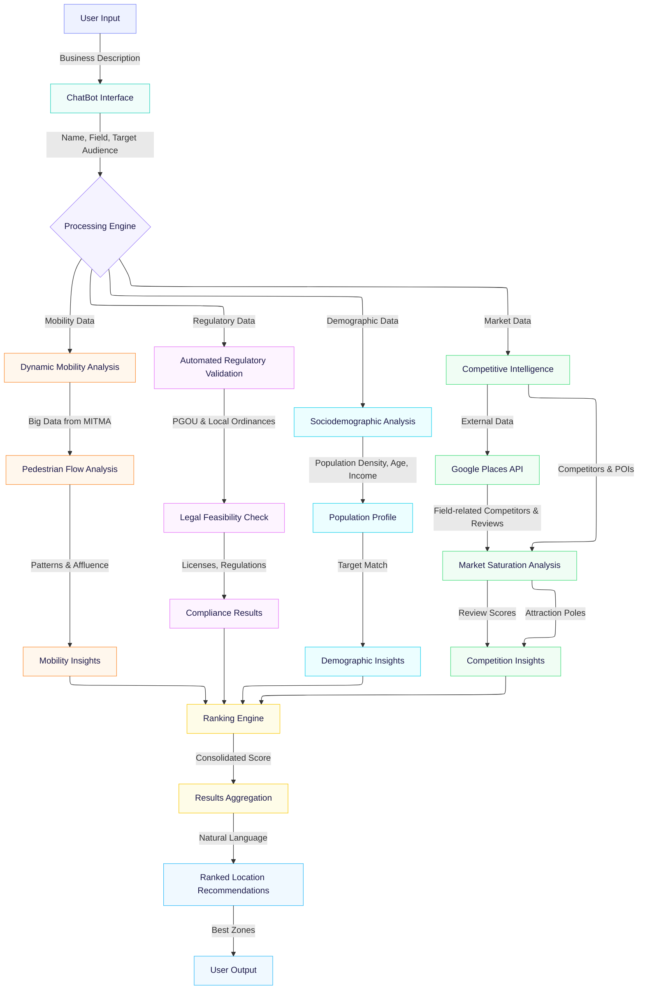

```mermaid
---
config:
  layout: elk
---
graph TD
    A[User Input] -->|Business Description| B[ChatBot Interface]
    B -->|Name, Field, Target Audience| C{Processing Engine}
    
    C -->|Mobility Data| D[Dynamic Mobility Analysis]
    D -->|Big Data from MITMA| E[Pedestrian Flow Analysis]
    E -->|Patterns & Affluence| F1[Mobility Insights]
    
    C -->|Regulatory Data| G[Automated Regulatory Validation]
    G -->|PGOU & Local Ordinances| H[Legal Feasibility Check]
    H -->|Licenses, Regulations| F2[Compliance Results]
    
    C -->|Demographic Data| I[Sociodemographic Analysis]
    I -->|Population Density, Age, Income| J[Population Profile]
    J -->|Target Match| F3[Demographic Insights]
    
    C -->|Market Data| K[Competitive Intelligence]
    K -->|Competitors & POIs| L[Market Saturation Analysis]
    L -->|Attraction Poles| F4[Competition Insights]
    
    %% Added Google Places API branch
    K -->|External Data| GP[Google Places API]
    GP -->|Field-related Competitors & Reviews| L
    L -->|Review Scores| F4
    
    F1 --> M[Ranking Engine]
    F2 --> M
    F3 --> M
    F4 --> M
    
    M -->|Consolidated Score| N[Results Aggregation]
    N -->|Natural Language| O[Ranked Location Recommendations]
    O -->|Best Zones| P[User Output]
    
    style A fill:#eef2ff,stroke:#818cf8,color:#1e1b4b
    style B fill:#f0fdfa,stroke:#2dd4bf,color:#1e1b4b
    style C fill:#f5f3ff,stroke:#a78bfa,color:#1e1b4b
    style D fill:#fff7ed,stroke:#fb923c,color:#1e1b4b
    style E fill:#fff7ed,stroke:#fb923c,color:#1e1b4b
    style F1 fill:#fff7ed,stroke:#fb923c,color:#1e1b4b
    style G fill:#fdf4ff,stroke:#e879f9,color:#1e1b4b
    style H fill:#fdf4ff,stroke:#e879f9,color:#1e1b4b
    style F2 fill:#fdf4ff,stroke:#e879f9,color:#1e1b4b
    style I fill:#ecfeff,stroke:#22d3ee,color:#1e1b4b
    style J fill:#ecfeff,stroke:#22d3ee,color:#1e1b4b
    style F3 fill:#ecfeff,stroke:#22d3ee,color:#1e1b4b
    style K fill:#f0fdf4,stroke:#4ade80,color:#1e1b4b
    style L fill:#f0fdf4,stroke:#4ade80,color:#1e1b4b
    style GP fill:#f0fdf4,stroke:#4ade80,color:#1e1b4b
    style F4 fill:#f0fdf4,stroke:#4ade80,color:#1e1b4b
    style M fill:#fefce8,stroke:#facc15,color:#1e1b4b
    style N fill:#fefce8,stroke:#facc15,color:#1e1b4b
    style O fill:#f0f9ff,stroke:#38bdf8,color:#1e1b4b
    style P fill:#f0f9ff,stroke:#38bdf8,color:#1e1b4b
```